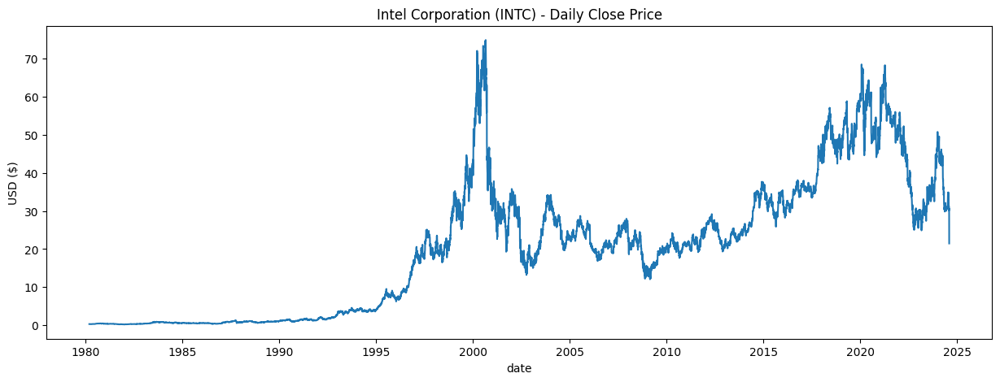
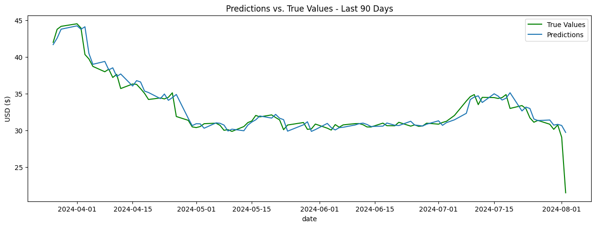

# Python Essentials

This repository contains a collection of Jupyter notebooks covering essential Python concepts and practices.

## Contents

1. Data Structures.ipynb
2. Functions and Classes.ipynb
3. Libraries.ipynb
4. Loops and Control Structures.ipynb
5. Practical Usage.ipynb

## Description

This collection of notebooks is designed to provide a comprehensive introduction to fundamental Python concepts. Each notebook focuses on a specific area of Python programming, allowing learners to progress through the material at their own pace.

### Notebooks

- **Data Structures.ipynb**: Covers Python's built-in data structures such as lists, tuples, dictionaries, and sets.
- **Functions and Classes.ipynb**: Introduces the concepts of functions and object-oriented programming in Python.
- **Libraries.ipynb**: Explores how to use and import external libraries in Python.
- **Loops and Control Structures.ipynb**: Teaches various looping techniques and control flow statements in Python.
- **Practical Usage.ipynb**: Demonstrates practical applications and real-world usage of Python concepts. Analysing Intel (INTC) Stock Close Prices and developing a predictive XGBoost model.

# Some charts from the Practical Usage Notebook:

## Getting Started

To use these notebooks:

1. Clone this repository to your local machine.
2. Ensure you have Jupyter Notebook installed.
3. Open the notebooks using Jupyter Notebook or JupyterLab.

## License

This project is licensed under the MIT License - see the [LICENSE](LICENSE) file for details.

## Contributing

Contributions to improve the notebooks or add new content are welcome. Please feel free to submit a pull request or open an issue.
